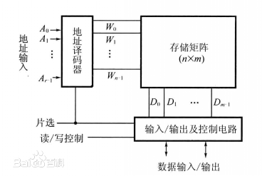
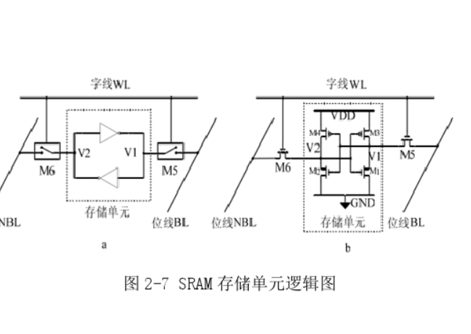

#  Technical Report On Computer Infrustructure

## Memory

### 内存简介

- 内存也叫作主存，是PC系统存放数据和指令的半导体存储器单元，也叫作主存储器。
- 通常有只读存储器（ROM-Read Only Memory）和随机存储器(RAM-Read Access Memory)和高速缓存存储器(Cache).
### 内存相关概念

#### 内存主频 
- 内存主频被用来表示内存的速度，它代表着该内存所能达到的最高工作频率。内存主频是以MHz（兆赫）为单位来计量的。内存主频越高在一定程度上代表着内存所能达到的速度越快。计算机系统的时钟速度是以频率来衡量的。晶体振荡器控制着时钟速度，在石英晶片上加上电压，其就以正弦波的形式震动起来，这一震动可以通过晶片的形变和大小记录下来。晶体的震动以正弦调和变化的电流的形式表现出来，这一变化的电流就是时钟信号。而内存本身并不具备晶体振荡器，因此内存工作时的时钟信号是由主板芯片组的北桥或直接由主板的时钟发生器提供的，内存无法决定自身的工作频率，其实际工作频率是由主板来决定的。
#### 内存容量
- 计算机的内存容量通常是指随机存储器（RAM)的容量，是内存条的关键性参数。内存的容量一般都是2的整次方倍。系统中内存的数量等于插在主板内存插槽上所有内存条容量的总和，内存容量的上限一般由主板芯片组和内存插槽决定。
#### 内存延迟
- 内存延迟是指等待对系统内存中存储数据的访问完成时引起的延期。根本问题在于处理器 （如英特尔&reg;至强TM处理器） 的主频接近4 GHz， 而内存芯片速率仅为400 MHz （如DDR 3200内存） —时钟速度之比为10:1。因此，当处理器需要处于内部高速缓存之外的数据项时，每个周期必须等待10个时钟周期才能使内存芯片完成数据的提取和发送。通常，这些提取需要检索多个内存周期，然后需要更长时间通过到处理器的路径。这就意味着提取数据会占用数百个处理器时钟周期，在此期间应用不能处理其它任何任务。
### 内存相关硬件
#### 随机存储器
- 随机存取存储器（Random Access Memory，缩写：RAM），也叫主存，是与CPU直接交换数据的内部存储器。它可以随时读写（刷新时除外），而且速度很快，通常作为操作系统或其他正在运行中的程序的临时数据存储介质。
##### RAM硬件结构及其工作原理

- 存储矩阵。相当于一个二维数组可以用来存储信息。
- 地址译码器。将寄存器地址的二进制数译成有效的行信号和列信号，以此来定位存储单元。
- 输入和输出。RAM可以通过输入输出数据线与CPU进行交换数据。
- 片选控制。就是由于RAM是很多集成在一起的，这时候就由这个硬件控制多个RAM中的一个或者是多个与CPU进行交互，而其他的RAM则被确认为断开状态。
##### RAM种类
- RAM分为SRAM和DRAM。
###### SRAM
- SRAM（静态随机存取存储器）是随机存取存储器的一种。只要保持通电，里面的数据就可以得到恒常的保存。但是电力消失的话，数据还是会消失的。它的存储原理是通过双稳态电路锁定电位高低，具有速度快，不用刷新等优点，但同时由于电路较为复杂，晶体管较多，集成度较低，运行功耗很大。
- SRAM原理图，如下
- 
###### SRAM原理解释
- 数据写入:
1. WL字线为低电位，置BL位线为1电位，NBL为0电位
2. 置WL为高电位，此时M5，M6导通
3. 存储单元的存储节点V2通过M6向NBL放电，达到0电位，M1截止
4. BL位线通过M5，VDD通过M3，对存储节点V1充电至1电位，M2导通
5. 置WL字线为低电位，M5,M6管关闭，此时存储单元的节点V1处于1电位状态，V2处于0电平的状态，这样就完成了向存储单元写入1的全过程。类似的方法可以写入0信号

- 数据读出
1. 预充BL和NBL位线到1电平，此时WL字线处于低电平状态。
2. 使WL字线为高电平，M5和M6导通
3. NBL通过M6和M2迅速放电至0电平，M1仍然截止。
4. VDD通过M3和M5对BL充电，使BL保持在1电平，M2仍然导通
5. 去掉字线上的WL的高电平，这样就完成了从存储单元读出1的全过程，而非破坏性读出。

- SRAM 数据保持
>当外界不访问单元时，字线WL处于低电平，这时使传播管M5，M6截止，位线BL，NBL和触发器之线的联系被中断，所以触发器状态不变。
>
###### DRAM
- DRAM利用电容存储电荷的原理保存信息，电路简单，集成度较高。但是由于电容存在着漏电的现象，所以为了避免信息丢失，在每隔一段时间都必须充电一次。刷新地址由刷新地址计数器产生，不是由地址总线提供。但是刷新是不能进行正常的读写操作。
- DRAM原理图如下。
- 
- Transistor，访问晶体管，它决定了是否允许对Capacitor进行信息的读写
- Capacitor，存储电容，通过电压的高低决定了逻辑上的1和0.
- Row line，决定了Transistor的导通或者截止。
- Column line外界访问 Capacitor的通道，可以对Capacitor
###### DRAM原理解析 
- 读数据
1. Row line设置为高电位，
2. 打开Transistor
3. Column line读取状态。
- 写数据
1. 写入的电位状态设定到Columnline
2. 打开Transistor
3. 通过Columnline改变Capacitor的状态。
##### RAM's Pros & Cons
- Advantage
1. 随机存储性.随时随地指定的向某个地址写入或者是读出
2. 访问速度很快.RAM几乎是所有访问设备中写入和读取速度最快的
- Disadvantage
1. 需要刷新（DRAM）.由于RAM是依赖电容保持电位的，一旦将电路放置过长的时间就要重新充电以保持电位的平衡
2. 对静电敏感性.由于其集成电路对静电荷非常敏感，静电会干扰电路，甚至会烧坏电路
#### ROM
- ROM（只读内存）Read-Only Memory,是一种只能读出事先所存储数据的固态半导体存储器，其特性是一种一旦写入ROM中就无法进行修改和删除，结构简单，读取方便一般用于不需要经常变更的电子产品中，存储的信息不回因为停电而消失。具体有ROM（写入不可改），PROM（只能写入一次），EPROM（利用高压将数据写入编程，抹除的时候需用紫外线）OTPROM(利用高压写入，但是无法进行抹除)，EEPROM（高压写入，利用高电场抹除）
#### Cache
- Cache ：即高速缓冲存储器，是位于CPU与主内存间的一种容量较小但速度很高的存储器。由于CPU的速度远高于主内存，CPU直接从内存中存取数据要等待一定时间周期，Cache中保存着CPU刚用过或循环使用的一部分数据，当CPU再次使用该部分数据时可从Cache中直接调用,这样就减少了CPU的等待时间,提高了系统的效率。Cache又分为一级Cache(L1 Cache)和二级Cache(L2 Cache)，L1 Cache集成在CPU内部。
### 内存现状与发展趋势
#### 现状
从最初的SDRAM 到DDR4，内存容量从64MB升级到了今天的16GB, 速率从133MHz升级到了今天的2133MHz, 单位功耗降低了80%以上
- 
- DDR-Double Data Rate SDRAM
- DDR2-第二代DDR
- DDR3-第三代DDR
- DDR4-第四代DDR
- LPDDR-Low Power DDR
- LPDDR2-第二代Low Power DDR
- LPDDR3-第三代Low Power DDR
- LPDDR4-第四代Low Power DDR
#### 发展趋势
- 2018年7月17日三星宣布成功开发出业内首款LPDDR5内存芯片, 基于10nm级 (10-20nm) 工艺。据悉, 该LPDDR5内存芯片单颗容量8GB (1GB) , 8GB容量的模组原型也做出据悉, 该LPDDR5内存芯片单颗容量8GB (1GB) , 8GB容量的模组原型也做出并完成功能验证。这颗业内首枚LPDDR5芯片具有极佳的性能, 其内存速度 (针脚带宽) 最高达3200MHz,是LPDDR4内存速度的1.5倍，同时功耗比LPDDR4降低了30%。
- 
- LPDDR5功耗大幅度下降，以及内存频数上升主要运用了以下技术。
1. I/O端口降低功耗。通过I/O端口降低电压实现。
2. 低频工作时降低功耗。用动态电压频率切换内核，动态电压频率切换数据，减少信号传输和数据命令地址分离等技术来实现。
3. 增加预读取倍数提高频率。
### 一些思考
- 内存将会越来越小，朝着更加适合移动设备的发展。
- 内存将会更加注重节能，然而仅仅靠降低电压很难有更大的空间，应该会诞生新的技术进行节能
- 内存可能在未来的某一个点会消失。当硬盘与CPU进行数据的交流更加快速的话，或许就不再需要内存。
- 内存频率并非一味的越快越好，需要和主板契合，一般主板会限制在2133MHz或2400MHz，可以通过BIOS调整参数改变默认频率。
- 在设计内存结构的时候为了兼顾掩藏内存存取延迟、芯片成本及功耗，基于处理器的设备通常都依赖一个多层内存结构。缓存由速度稍慢的内存构成来掩藏大量速度较慢内存的延迟。而较大缓存通常意味着牺牲更多芯片面积而实现较少的缓存丢失。因此内存的配备应该充分地进行权衡考虑。

# Storage

# Network

# xPU