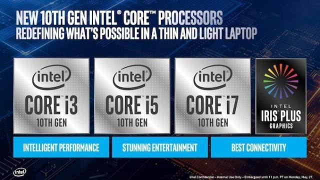
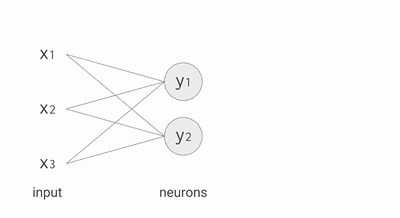
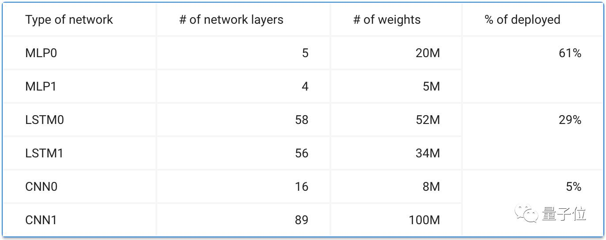
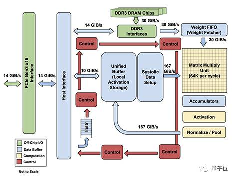
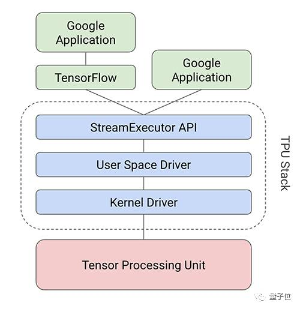
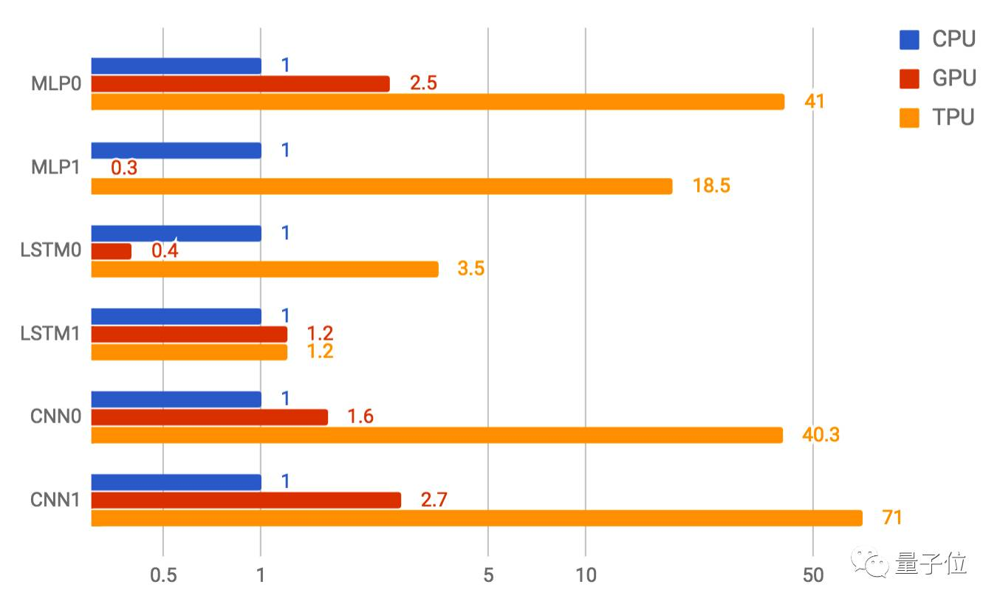
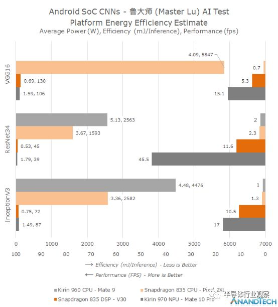

#  Technical Report On Computer Infrustructure

## CPU

cpu性能衡量标准： 核心数，频率，缓存，架构

常见品牌：龙芯，酷睿，锐龙，骁龙

intel的i3,i5,i7代表性能的高低,后面的一开始的数字代表第几代,后三位代表在当代cpu的性能,性能越强数字越大。
如"core i5-8100"

如今酷睿系列已经出到第十代，使用Ice Lake架构，特点稳定功耗低，单核处理能力强。

锐龙系列则推出锐龙9，AMD 锐龙 9 3950X有16核32线程，超频达到4.7GHz

对比intel和amd，两个系列中前者单核处理能力强于后者，更适合游戏本，amd更支持超频，且线程数多，耗电多，价格较低，适合做adobe系列的媒体处理软件的cpu，视频剪辑与渲染等专业软件有专业算法提高多线程的利用效率，线程多的锐龙更占优势。

## Memory

衡量标准: 容量, 频率, 延迟(时序)

常见内存条品牌:金士顿, 三星, 威刚

内存最关键的是内存芯片(内存颗粒,三星、镁光、海力士等为主要生产厂家)

一般ddr3的4G或8G内存条已经足够个人使用，双通道可以提高一倍速率。

内存频率并非一味的越快越好，需要和主板契合，一般主板会限制在2133MHz或2400MHz，可以通过BIOS调整参数改变默认频率。

在相同频率下，延迟越低的在超频时表现越好。

## Storage

衡量标准：容量, 带宽

硬盘分为固态硬盘、机械硬盘和混合硬盘

机械硬盘与固态硬盘优缺点对比：

机械硬盘价格低，容量大，寿命长

固态硬盘性能更优，功耗低，体型小，散热快

混合硬盘则是处于机械硬盘和固态硬盘中间的一种解决方案

## Network

衡量标准：传输效率、稳定性、端口数量、支持协议、安全性等

品牌：华硕、腾达、华为、普联等

路由转发方式有软件方式与硬件转发。软件方式一般采用的是集中式路由，硬件转发可分成集中式与分布式的硬件转发方式，后者是新一代网络的代表。

无线路由器有WAN口和LAN口,wifi有2.4G和5G两种，有的支持双频合一

前者每根天线的传输速率为150Mbps，速度慢，信号弱，延迟大但穿墙能力强

后者每根433Mbps，速度快信号强，延迟小但穿墙能力差。

初始的路由器的信号需要排队，mimo技术可以帮助多根天线同时传输，但是要求接收者也有多根接收天线，mu-mimo技术可以实现多天线并发，但还不太成熟。

wifi信号强度则与发射功率和天线增益有关。

路由器内部有cpu、内存等，其算法也会影响效果，若信号强而网速慢则可能是路由器算法的问题。

## xPU

### GPU

####  衡量标准：GPU架构、核心频率、流处理器(CUDA)数量、显存、显存类型、显存位宽、显存频率等

常见品牌：AMD Nvidia

N卡效率高，功耗高；A卡理论效率高，但实际效率不如N卡，但是A卡功耗低。所以坊间流传一段话，游戏选N卡，工作选A卡。

一般频率高、流处理器数量多的较优。

显存大、位宽大、显存频率高、分辨率高则强，相仿的则可以选择带宽大的(频率乘位宽)。

#### 测试方法

可以使用*3DMARK, GPU-Z, GPU CAPS VIEWERS*等进行测试

#### COMMENT

一般办公只需要cpu内置显卡即可，独立显卡游戏选N卡，工作选A卡, 从事3D图像渲染，视频动画制作等工作的需要更加高端的显卡如RTX2080、RTX2080Ti等。

### TPU

TPU是**张量处理单元**，是一种定制化的 ASIC 芯片，它由谷歌从头设计，并专门用于机器学习工作负载。TPU 为谷歌的主要产品提供了计算支持，在 Google Next’18 中，TPU v2 现在已经得到用户的广泛使用

使用RISC指令集的CPU进行的是标量运算, GPU则是矢量运算，但是在神经网络方面存在着较大局限性。Google为TPU设计了MXU作为矩阵处理器，可以在单个时钟周期内处理数十万次运算，也就是矩阵（Matrix）运算

神经网络把输入数据与权重矩阵相乘，并输入激活函数

矩阵乘法的计算量十分巨大，在google实际业务的数据统计(如下表)中,权重矩阵的数据量级在**百万级别**以上，对于CPU或GPU来说负担巨大，作为优化，TPU被设计出来用于这类大运算量的张量运算。

神经网络的量化技术是一种**使用8位整数来近似预设的最小值和最大值之间任意数值**的优化技术,这种技术允许用整数运算来代替浮点运算，大大减少了TPU的硬件规模和功耗，一个TPU钟包含**65,536个8位整数乘法器**。云环境中使用的主流GPU，通常包含数千个32位浮点乘法器。只要能用8位满足精度需求，就能带来25倍以上的性能提升。

TPU包括以下计算资源：

1. 矩阵乘法单元(MUX)：65,536个8位乘法和加法单元，运行矩阵计算

2. 统一缓冲(UB)：作为寄存器工作的24MB容量SRAM

3. 激活单元(AU)：硬件连接的激活函数

TPU设计封装了神经网络计算的本质，可以针对各种神经网络模型进行编程，使用CISC指令集作为基础支持一系列复杂指令。

为了编程，Google还创建了一个编译器和软件栈，将来自TensorFlow图的API调用，转化成TPU指令。

#### 性能对比

TPU的性能功耗比，比同时期的CPU强83倍，比同时期的GPU强29倍。

在神经网络运算上面的性能对比,TPU拥有巨大优势。

reference: 
http://www.sohu.com/a/140291947_610300

### NPU

NPU与TPU的定位不同，神经网络的使用分为训练和推理两部分，训练需要庞大的计算，而推理过程的计算量则远少于训练，因此也可以在较为便宜的硬件上进行。NPU的专长在于神经网络的推理过程。

相对于上传数据到服务器，由服务器进行推理再返回的做法，边缘计算具有更好的性能和更低的消耗，这一过程将会减轻可能存在的延迟，功耗和带宽等问题，同时也避免了隐私问题，因为输出端数据永远不会离开用户设备。

NPU便是在可以用户设备上进行神经网络边缘计算的芯片，在神经网络方面相对于CPU, GPU等更具竞争力。

鲁大师基准测试软件在最近推出了一个基于人工智能测试的框架，用来测试NPU和高通SNPE框架。目前该基准测试能够测试三种不同的神经网络，VGG16, InceptionV3和ResNet34。

当使用CPU来进行运算的时候，通常情况下CPU只能以1-2fps的速率进行计算，而所需要的功耗也异常的高。比如骁龙835和麒麟960的CPU在运算的时候，都需要以超过平均负载的工作负载进行运算。

相比较而言，高通的Hexagon DSP能够实现相对于CPU5到8倍的性能。

而华为的NPU的性能则更加明显，相对于ResNet34，NPU能够实现4倍的性能提升。

reference：
http://www.elecfans.com/d/622258.html

### FPGA 

